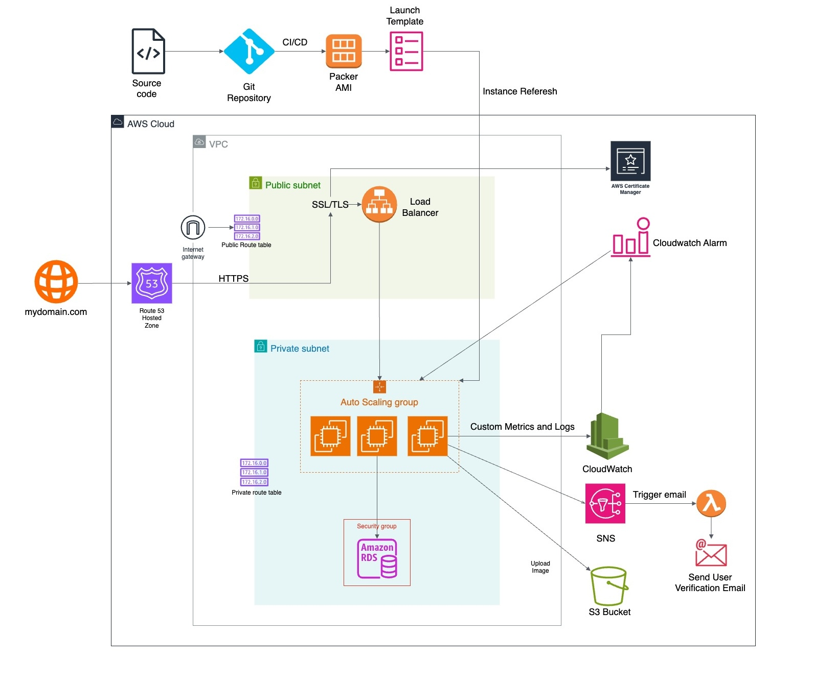

# Web Application

## Project Overview

This project is a backend-only web application designed to manage users, their profile pictures, and related operations. The application follows modern cloud-native and security best practices, leveraging AWS services, Spring Boot, and a modular infrastructure-as-code setup for scalable and secure deployments. Key features include RESTful APIs for user management, file storage on S3, and extensive observability through metrics and logs.

## Architecture Diagram

## Features

### Core Functionalities

1. **User Management**:

    - Create, update, and retrieve user accounts.
    - Secure password storage using BCrypt.
    - Validation and error handling for clean data input.

2. **Profile Picture Management**:

    - Upload profile pictures to AWS S3.
    - Delete profile pictures from both S3 and the database.
    - Support for common image formats like PNG, JPG, and JPEG.

3. **Authentication and Authorization**:

    - Authentication using Spring Security with Basic Authentication.
    - Role-based access control to restrict operations to authorized users.

4. **Health Monitoring**:

    - A health check endpoint (`/healthz`) to verify database connectivity and application status.

### Observability

- **Metrics**:
    - API-level metrics: Call counts and execution times for endpoints.
    - Database-level metrics: Query execution times.
    - StatsD integration for real-time performance monitoring.
- **Logging**:
    - Consistent error and info logs for debugging and analysis.

### AWS Integration

- **S3 for File Storage**:
    - Secure, scalable storage for user profile pictures.
- **IAM Role-Based Access**:
    - EC2 instances are configured with IAM roles for secure S3 access.
- **CloudWatch**:
    - Custom metrics and logs forwarded to AWS CloudWatch.

### CI/CD Pipeline

- Automated testing, building, and deployment with GitHub Actions.
- Packer and Terraform integration for AMI creation and infrastructure provisioning.
- Dynamic instance refresh and scaling using AWS Auto Scaling Groups.

## API Endpoints

### Public Endpoints

1. **POST /v1/user**:

    - Create a new user.

2. **GET /healthz**:

    - Health check endpoint to verify database connectivity.

### Secured Endpoints (Authentication Required)

1. **GET /v1/user/self**:

    - Retrieve details of the authenticated user.

2. **PUT /v1/user/self**:

    - Update details of the authenticated user.

3. **POST /v1/user/self/pic**:

    - Upload a profile picture for the authenticated user.

4. **DELETE /v1/user/self/pic**:

    - Delete the authenticated user’s profile picture.

## Infrastructure

### Cloud Architecture

1. **VPC and Networking**:

    - Custom VPC with public and private subnets across multiple Availability Zones.
    - Internet Gateway for public access.

2. **Compute**:

    - EC2 instances deployed in an Auto Scaling Group with a Launch Template.
    - Instances configured with encrypted EBS volumes using custom KMS keys.

3. **Database**:

    - PostgreSQL RDS instance hosted in private subnets.
    - Encrypted with KMS keys and credentials managed via AWS Secrets Manager.

4. **File Storage**:

    - S3 bucket with server-side encryption (SSE-S3) and access restricted via IAM policies.

### Security

- **Encryption**:
    - All sensitive data encrypted at rest using KMS keys.
    - HTTPS recommended for secure data transmission.
- **IAM Roles and Policies**:
    - Principle of least privilege applied to all roles.
    - Secure access to AWS services for EC2 and Lambda.
- **Secrets Management**:
    - Database credentials and API keys managed securely with AWS Secrets Manager.

## Deployment

1. **Setup**:

    - Use Terraform to provision infrastructure.
    - Use Packer to create AMIs for application deployment.

2. **CI/CD Workflow**:

    - Build and test application with GitHub Actions.
    - Automate deployment pipeline for infrastructure and application updates.

## Observability and Monitoring

- **Metrics**:
    - Real-time application metrics collected with StatsD and visualized in CloudWatch.
- **Logs**:
    - Application logs sent to CloudWatch for monitoring and debugging.

## Best Practices Followed

1. **Secure Design**:

    - Password hashing with BCrypt.
    - Least privilege access for AWS resources.

2. **Scalable Architecture**:

    - Auto Scaling Groups for EC2 instances.
    - S3 for highly available and scalable file storage.

3. **Modular Codebase**:

    - Clean separation of concerns with service and controller layers.

4. **Infrastructure as Code**:

    - Fully automated and reproducible infrastructure setup with Terraform.

## Related Repositories

- **Infrastructure Code**: [tf-aws-infra](https://github.com/AmitAnveri/tf-aws-infra)
- **Serverless Code**: [serverless](https://github.com/AmitAnveri/serverless)

## Conclusion

This backend application is production-ready with robust security, scalability, and monitoring features.
